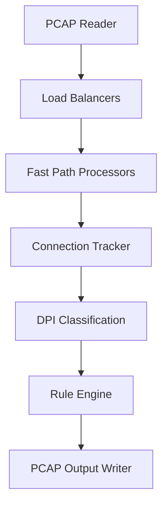

# Multi-threaded Deep Packet Inspection Engine

A multi-threaded Deep Packet Inspection (DPI) engine that analyzes PCAP network traffic, classifies applications (TLS SNI / HTTP / DNS), and applies rule-based filtering while producing a filtered PCAP output.

## Sample Output

```text
╔══════════════════════════════════════════════════════════════╗
║              DPI ENGINE  (Multi-threaded)                    ║
╠══════════════════════════════════════════════════════════════╣
║ Load Balancers:  2    FPs per LB:  2    Total FPs:  4        ║
╚══════════════════════════════════════════════════════════════╝

[Reader] Processing packets...
[Reader] Done reading 77 packets

╔══════════════════════════════════════════════════════════════╗
║                      PROCESSING REPORT                       ║
╠══════════════════════════════════════════════════════════════╣
║ Total Packets:     77                                        ║
║ Total Bytes:       5738                                      ║
║ TCP Packets:       77                                        ║
║ UDP Packets:       0                                         ║
╠══════════════════════════════════════════════════════════════╣
║ Forwarded:         69                                        ║
║ Dropped:           8                                         ║
╚══════════════════════════════════════════════════════════════╝
```


## Why This Project Is Interesting

Deep Packet Inspection systems must process large volumes of traffic while maintaining per-flow state and performing protocol-aware classification. 

This engine demonstrates:
- parallel packet processing using load-balanced worker threads
- protocol-level traffic classification (TLS SNI / HTTP / DNS)
- connection tracking using five-tuple flow identifiers
- rule-based packet filtering with PCAP output generation

## Example Traffic Analysis

The engine analyzes encrypted traffic using TLS SNI extraction. 
Example classification:

| Domain | Application |
|--------|-------------|
| youtube.com | YouTube |
| facebook.com | Facebook |
| github.com | GitHub |
| discord.com | Discord |

## Problem

Modern networks carry large volumes of encrypted and application-specific traffic. Network monitoring tools need to:

- Inspect packets at high speed
- Identify applications from encrypted traffic
- Apply filtering rules
- Process traffic in parallel

This project implements a Deep Packet Inspection (DPI) system that analyzes PCAP traffic and classifies applications using protocol-level inspection.

## System Architecture



## Performance Design

The engine uses a multi-stage pipeline:
`Reader → Load Balancer → Fast Path Workers`

Packets are distributed using **five-tuple hashing** so that packets from the same flow are processed by the same worker thread. This avoids cross-thread synchronization overhead while maintaining correct stateful connection tracking.

## Features

- PCAP packet parsing
- TLS SNI extraction
- HTTP Host header parsing
- DNS query extraction
- Multi-threaded packet processing
- Flow-based connection tracking
- Rule-based traffic blocking
- Filtered PCAP output generation

## Tech Stack

- **Language:** Java
- **Build Tool:** Gradle
- **Networking:** PCAP file parsing
- **Concurrency:** Java threads / thread-safe queues
- **Protocols:** Ethernet, IPv4, TCP, UDP, TLS, HTTP, DNS

## Project Structure

```text
src/main/java/org/example/
├── core/
│   ├── PacketParser.java
│   ├── Types.java
│   ├── SNIExtractor.java
│   ├── HTTPHostExtractor.java
│   └── DNSExtractor.java
├── processing/
│   ├── FastPathProcessor.java
│   ├── FPManager.java
│   └── PacketOutputCallback.java
├── engine/
│   ├── DPIEngine.java
│   ├── LoadBalancer.java
│   └── LBManager.java
├── connection/
│   ├── ConnectionTracker.java
│   └── GlobalConnectionTable.java
├── rules/
│   └── RuleManager.java
├── pcap/
│   ├── PcapReader.java
│   ├── PcapGlobalHeader.java
│   └── PcapPacketHeader.java
└── Main.java
```

## Run the Engine

Build using Gradle:

```bash
./gradlew build
```

The build generates an executable JAR (`dpi-engine.jar`) in the project root for easy execution.

```bash
java -jar dpi-engine.jar testdpi.pcap output.pcap
```

## Quick Demo

```bash
java -jar dpi-engine.jar testdpi.pcap output.pcap --block-app YouTube
```
Example result:
```text
Packets analyzed: 77
Packets forwarded: 69
Packets dropped: 8
Applications detected: HTTPS, DNS, YouTube, Facebook
```

## Example Use Case

Blocking YouTube traffic from a PCAP capture:

```bash
java -jar dpi-engine.jar testdpi.pcap output.pcap --block-app YouTube
```

Output `output.pcap` will contain only allowed packets.

## Output Statistics

The engine reports:

- Total packets processed
- TCP/UDP breakdown
- Packets forwarded vs dropped
- Thread-level processing distribution
- Application classification statistics (Classified vs Unidentified proportions)

## What I Learned

- Implementing packet parsing for multiple networking layers and protocols
- Designing multi-threaded network processing pipelines with concurrent queues
- Building rule-based traffic filtering systems
- Implementing application classification from encrypted traffic via extension mappings

## Future Improvements

- HTTP/2 parsing
- QUIC protocol detection
- Real-time packet capture bypassing PCAP files via `libpcap` wrappers
- Web dashboard for continuous monitoring
